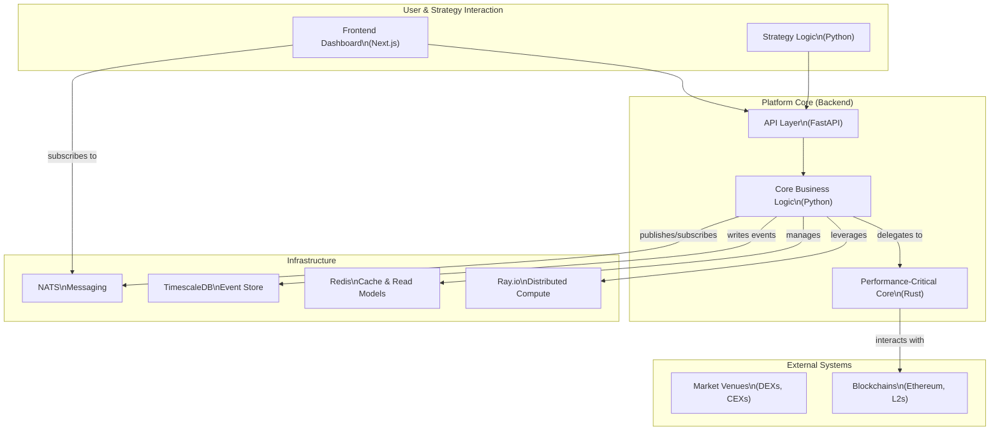
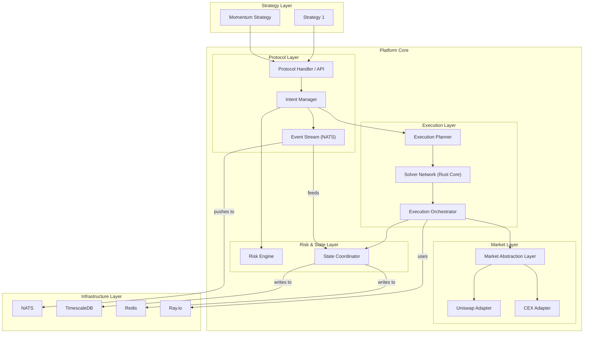
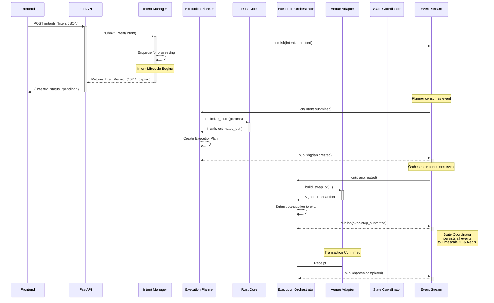
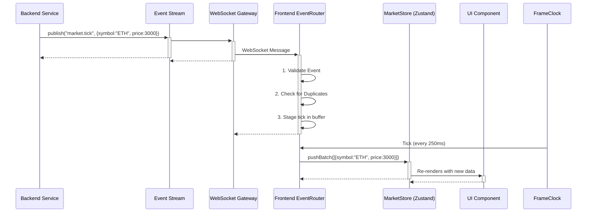
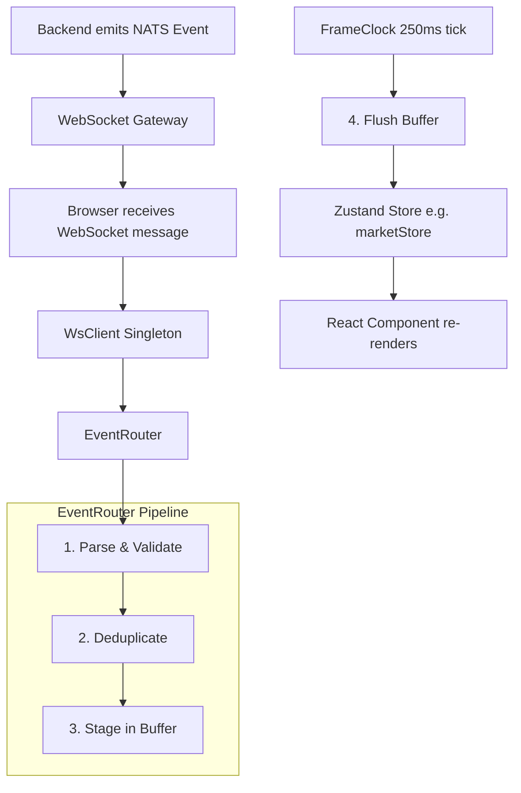

# **Strategy Execution Platform: Definitive Technical Reference**

**Version:** 1.0  
**Date:** 2025-08-22  
**Status:** DRAFT  
**Audience:** System Architects, Backend Engineers, Frontend Engineers, DevOps, Quantitative Developers

---

## **Table of Contents**

### **Part I: System Foundation**

- **1. Introduction & Executive Summary**
  - 1.1. Purpose of This Document
  - 1.2. Executive Summary: What is this Platform?
  - 1.3. Core Philosophy: Intent-Driven Execution
  - 1.4. The Hybrid Performance Model: Python Meets Rust
  - 1.5. Reading Paths for Different Roles
- **2. System Architecture Overview**
  - 2.1. The 30,000-Foot View: Layers and Boundaries
  - 2.2. Component-Level Breakdown and Interaction Diagram
  - 2.3. System Layers
  - 2.4. Component Breakdown Table
- **3. Core Design Decisions**
  - 3.1. Why Intent-Driven Architecture?
  - 3.2. Why a Hybrid Python/Rust Backend?
  - 3.3. Why Event Sourcing with CQRS?
  - 3.4. Why NATS for Real-Time Messaging?
  - 3.5. Why Server-Side Rendering (SSR) with a Real-Time Overlay?
  - 3.6. Why a Dual-State Frontend?
- **4. The Infrastructure Stack**
  - 4.1. TimescaleDB (Event Store)
  - 4.2. Redis (Cache & Read Models)
  - 4.3. Ray.io (Distributed Compute)
  - 4.4. Docker (Containerization)

### **Part II: The Backend Engine**

- **5. Core Components: Backend**
  - 5.1. Intent Subsystem
  - 5.2. Execution Subsystem
  - 5.3. Market and Venue Adapters
  - 5.4. State and Streaming Subsystems
  - 5.5. Performance Core (Rust)
- **6. The Lifecycle of an Intent: A Journey Through the System**
  - 6.1. The Spark: Defining and Understanding the Intent Model
  - 6.2. Stage 1: Submission via the API
  - 6.3. Stage 2: The Gatekeeper - Validation and Prioritization
  - 6.4. Stage 3: The Strategist - Planning and Optimization
  - 6.5. Stage 4: The Conductor - Orchestration and Execution
  - 6.6. Stage 5: The Scribe - State Coordination and Finality
- **7. Data Models and Flows**
  - 7.1. Core Data Models (Pydantic)
  - 7.2. Key Data Flows
  - 7.3. Flow 1: Intent Submission and Execution (Happy Path)
  - 7.4. Flow 2: Real-Time UI Update
- **8. The Performance Core: Inside the Rust Engine**
  - 8.1. The Bridge: How Python and Rust Communicate (PyO3)
  - 8.2. Finding the Best Path: The Route Optimization Engine
  - 8.3. Low-Level Power: Transaction Decoding and Chain Monitoring
- **9. Developing a Trading Strategy: A Practical Guide**
  - 9.1. The Foundation: The BaseStrategy Framework
  - 9.2. Deconstructing an Example: The MomentumStrategy
  - 9.3. Tutorial: Building a Simple Dollar-Cost Averaging (DCA) Strategy

### **Part III: The Frontend Dashboard**

- **10. Core Components: Frontend**
  - 10.1. Real-Time Data Layer
  - 10.2. State Management
  - 10.3. UI and Component Architecture
- **11. Frontend Architecture: The Real-Time Dashboard**
  - 11.1. A Tale of Two States: Zustand vs. TanStack Query
  - 11.2. The Real-Time Data Pipeline: From WebSocket to Pixel
  - 11.3. The First Impression: SSR Bootstrap and Client Hydration
  - 11.4. A Consistent Look and Feel: Styling and Theming

### **Part IV: Integration, Operations, and Advanced Topics**

- **12. Integration Points: APIs and Events**
  - 12.1. REST API (FastAPI)
  - 12.2. WebSocket API
  - 12.3. Internal Messaging (NATS Subjects)
- **13. Advanced Concepts and Future-Ready Design**
  - 13.1. Handling Complexity: Multi-Chain and Cross-Chain Transactions
  - 13.2. The Brains of the Operation: Machine Learning Integration
- **14. V1 Development and Operations Guide**
  - 14.1. V1 Prototype: Scope and Milestones
  - 14.2. V1 Acceptance Criteria
  - 14.3. Setting Up a Local Environment
  - 14.4. Troubleshooting Common Issues
- **15. Appendices**
  - 15.1. Glossary of Terms
  - 15.2. Key Codebase File References
  - 15.3. Conflict Resolution Log

---

## **Part I: System Foundation**

### **1. Introduction & Executive Summary**

#### **1.1. Purpose of This Document**

Welcome to the definitive technical guide for the Strategy Execution Platform. This document is crafted to be the single source of truth for the system's architecture, design patterns, and implementation details. It is intended for software architects, engineers, and technical stakeholders involved in the development, maintenance, and extension of the system.

It is a living document, intended to onboard new engineers, guide architectural reviews, and serve as a long-term reference for maintenance and extension. We will go beyond surface-level descriptions to explore the _rationale_ behind our design choices, providing you with a deep and practical understanding of how and why the system works the way it does.

#### **1.2. Executive Summary: What is this Platform?**

The Strategy Execution Platform is an advanced, event-driven system designed to provide a standardized execution layer between automated trading strategies and fragmented market venues. It abstracts the complexity of trade execution across disparate blockchain networks and market venues, translating high-level strategic goals, or "intents," into optimized, risk-managed execution plans.

The system leverages a hybrid Python and Rust architecture for a unique blend of flexibility and high performance. It provides a standardized layer that allows automated trading strategies to express high-level goals—or **"Intents"**—without needing to manage the low-level mechanics of order routing, gas optimization, risk management, and settlement.

At its core, the platform is an engine for translating strategic goals into optimized, auditable actions. It is built to be **robust, scalable, and performant**, capable of handling the demands of sophisticated quantitative trading in the decentralized finance (DeFi) ecosystem, with sub-50ms latency targets for core operations and a target latency of <50ms for all critical-path operations.

#### **1.3. Core Philosophy: Intent-Driven Execution**

The single most important concept to grasp is that this is an **intent-driven system**. This is a fundamental departure from traditional imperative systems where a strategy would script every single action (e.g., "connect to Uniswap, set gas to 30 gwei, approve token, execute swap").

In our paradigm, a strategy declares its desired end state:

> _"I want to **acquire** 10 WETH using USDC, and I am willing to tolerate a maximum of 0.5% slippage. This goal must be achieved within the next 5 minutes."_

This declaration is encapsulated in an `Intent` object. The platform ingests this intent and takes on the full responsibility for achieving the goal. It will:

- Validate the intent against current portfolio risk
- Find the most capital-efficient route (which might involve multiple hops across different DEXs)
- Break the order into smaller pieces to minimize market impact
- Monitor network conditions to choose the optimal time to submit the transaction
- Protect the transaction from malicious actors (MEV)
- Handle any failures and retries gracefully

This abstraction is incredibly powerful. It **decouples strategy logic from execution logic**. Strategy developers can innovate and iterate on their alpha-generating models without ever needing to become experts on the latest DEX aggregator or gas pricing oracle. The platform's core engineering team can, in parallel, continuously improve the execution engine without breaking any of the strategies that rely on it.

#### **1.4. The Hybrid Performance Model: Python Meets Rust**

To achieve both developer velocity and elite performance, the platform employs a hybrid architecture.

- **Python (The Orchestrator)**: The vast majority of the backend is written in modern, asynchronous Python 3.13+. We leverage the rich data science and web development ecosystems, using libraries like FastAPI for our API layer, Pydantic for data modeling, and Polars for data manipulation. Python's flexibility and expressiveness make it the perfect language for defining strategies, orchestrating complex workflows, and managing high-level business logic where developer velocity is paramount.

- **Rust (The Engine)**: For tasks where every microsecond counts, we drop down to a native Rust core. Rust provides unparalleled performance, memory safety, and fearless concurrency, making it the ideal choice for computationally intensive problems. These include:
  - **Optimal Route Finding**: Calculating the best path for a trade across dozens of liquidity pools
  - **Transaction Decoding**: Parsing raw blockchain data in real-time
  - **Market Data Aggregation**: Processing high-frequency order book updates

This Rust core is compiled into a native Python module using **PyO3**, allowing our Python code to call these high-performance Rust functions as if they were native Python functions. This gives us the best of both worlds.

- **Code Reference**: See the bridge in `platform/rust_bindings.py` and the Rust source in `src/`.

#### **1.5. Reading Paths for Different Roles**

- **System Architects**: Begin with Sections 1 and 2 to understand the high-level design. Then, jump to Section 13 to explore advanced concepts and future-readiness.
- **Backend Engineers**: Start with Sections 2 and 6 for a complete picture of the system flow. Then, dive into Section 9 to learn how to build strategies and Section 8 for the Rust core.
- **Frontend Engineers**: Read Sections 1 and 2 for context, then focus entirely on Sections 10 and 11, which detail the frontend architecture, state management, and real-time data pipeline.
- **Quantitative Developers**: Section 9 is your primary guide. It will teach you how to integrate your models and generate intents within the `BaseStrategy` framework.

### **2. System Architecture Overview**

#### **2.1. The 30,000-Foot View: Layers and Boundaries**

The system is designed with distinct layers, each with a clear set of responsibilities. This separation of concerns makes the system easier to understand, maintain, and scale.



#### **2.2. Component-Level Breakdown and Interaction Diagram**



This diagram illustrates the flow of control and data. A strategy submits an intent to the `Protocol Handler`. The `Intent Manager` validates it against the `Risk Engine` and publishes an event. The `Execution Planner` consumes this event, consults the `Solver Network` (Rust core) to find the best route, and creates a plan. The `Execution Orchestrator` executes this plan via the appropriate `Venue Adapter`. Throughout this process, events are published to the `Event Stream` and persisted by the `State Coordinator`.

#### **2.3. System Layers**

- **User & Strategy Interaction**: The entry points to the system. The Frontend Dashboard allows human traders to monitor and submit intents. Strategy Logic, running as Python processes, programmatically submits intents.

- **Platform Core (Backend)**: The brain of the system.
  - The **API Layer** (FastAPI) provides REST and WebSocket endpoints for intent submission and status tracking.
  - **Core Business Logic** (Python) orchestrates the entire intent lifecycle, from validation and planning to execution and state management.
  - The **Performance-Critical Core** (Rust) handles low-latency tasks like market data processing and optimal trade routing.
- **Infrastructure**: The supporting services.
  - **NATS** serves as the real-time messaging backbone for inter-service communication and frontend updates.
  - **TimescaleDB** is the immutable event store, providing a source of truth for all system activity.
  - **Redis** caches frequently accessed data and stores materialized read models for fast UI queries.
  - **Ray.io** provides a framework for distributed computation, primarily used for parallelizing intent processing and ML model inference.
- **External Systems**: The platform interacts with various blockchains and market venues to execute trades.

#### **2.4. Component Breakdown Table**

| Layer          | Component              | Responsibility                                                                    | Technology                 |
| :------------- | :--------------------- | :-------------------------------------------------------------------------------- | :------------------------- |
| **Strategy**   | Strategy Objects       | Defines trading logic; generates `Intent` objects.                                | Python                     |
| **Protocol**   | Intent Manager         | Accepts, validates, queues, and tracks the lifecycle of intents.                  | Python                     |
|                | Event Stream           | Manages publishing and subscribing to system-wide events.                         | NATS, Python               |
| **Execution**  | Execution Planner      | Decomposes intents into concrete `ExecutionPlan`s; queries solvers.               | Python, Rust               |
|                | Execution Orchestrator | Executes plans step-by-step, interacting with market adapters.                    | Python                     |
|                | Solver Network         | (Future) A competitive network to find optimal execution paths.                   | Rust                       |
| **Market**     | Market Abstraction     | Provides a unified interface to various market venues.                            | Python                     |
|                | Venue Adapters         | Concrete implementations for interacting with DEXs, CEXs, etc.                    | Python                     |
| **Risk**       | Risk Engine            | Performs pre-trade risk checks (notional, slippage) and portfolio-level analysis. | Python                     |
| **State**      | State Coordinator      | Persists events to the event store and updates read models.                       | Python, TimescaleDB, Redis |
| **Settlement** | Settlement Manager     | (Future) Manages cross-chain settlement and reconciliation.                       | Python                     |

### **3. Core Design Decisions**

#### **3.1. Why Intent-Driven Architecture?**

By separating the _what_ (the strategy's goal, or `Intent`) from the _how_ (the `ExecutionPlan`), the platform gains immense flexibility. Strategy developers can focus purely on signal generation without worrying about the intricacies of gas management, slippage control across different venues, or transient network issues. This abstraction allows the core platform to evolve its execution logic—such as introducing a new DEX, a more advanced routing algorithm, or MEV protection—without requiring any changes to existing strategies.

#### **3.2. Why a Hybrid Python/Rust Backend?**

This hybrid model offers the best of both worlds:

- **Python's Strengths**: Its rich ecosystem, ease of use, and rapid development cycle make it ideal for the system's orchestration layer. This includes the API server (FastAPI), strategy framework, and high-level business logic where developer velocity is paramount. Libraries like Pydantic, Polars, and Ray.io are seamlessly integrated.

- **Rust's Strengths**: For performance-critical hot paths, Rust provides memory safety, fearless concurrency, and near-bare-metal speed. We delegate tasks like decoding blockchain transactions, aggregating order books, and running Dijkstra's algorithm for route optimization to a Rust core compiled to a native Python module via PyO3. This ensures we can meet our sub-50ms latency targets for core operations.

- **Reference**: `platform/rust_bindings.py`, `src/lib.rs`

#### **3.3. Why Event Sourcing with CQRS?**

In a system where auditability and reliability are paramount, simply overwriting data in a traditional CRUD (Create, Read, Update, Delete) database is insufficient and dangerous. We chose **Event Sourcing** because it provides a perfect, immutable log of everything that has ever happened in the system.

**How it Works:**

Instead of storing the _current state_ of an `Intent`, we store the sequence of _events_ that describe its history.

- **Traditional DB:**
  `intents` table: `id: "abc", status: "COMPLETED"`

- **Event Sourced System:**
  `events` table:
  1. `id: 1, aggregate_id: "abc", type: "IntentSubmitted"`
  2. `id: 2, aggregate_id: "abc", type: "IntentValidated"`
  3. `id: 3, aggregate_id: "abc", type: "PlanCreated"`
  4. `id: 4, aggregate_id: "abc", type: "ExecutionCompleted"`

To get the current state of intent "abc", we simply replay these events in order. This gives us incredible benefits:

1. **Full Audit Trail**: We know exactly what happened and when. In a financial system, having an immutable, chronological log of every action is non-negotiable for audits, debugging, and compliance.
2. **Debugging Power**: We can reproduce the exact state of the system at the time of a bug.
3. **Temporal Queries**: We can ask questions like "What did this portfolio look like yesterday?"
4. **Replayability**: We can rebuild the state of any entity (like an `Intent`) at any point in time by replaying its events.

However, replaying events every time we need to read data can be slow. This is where **Command Query Responsibility Segregation (CQRS)** comes in. We separate our application into two distinct sides:

- **The Command Side**: Handles actions that change state (e.g., `SubmitIntent`, `ExecuteTrade`). Its only job is to validate the command and produce an event. It writes to the event store (TimescaleDB).
- **The Query Side**: Handles reading data. It listens to the stream of events and builds materialized "read models" optimized for fast queries. For example, we maintain a simple key-value store in Redis: `intent:abc -> { "status": "COMPLETED", ... }`.

When the UI needs the status of an intent, it queries the fast Redis read model, not the transactional event store. This makes the system both highly auditable and highly performant. Our write path is optimized for high-throughput event persistence into TimescaleDB. The read path uses materialized views (aggregates) stored in Redis, which are specifically designed to answer UI queries with minimal latency. This prevents read queries from bogging down the transactional write path.

- **Reference**: `platform/state/coordinator.py`, `platform/types/events.py`

#### **3.4. Why NATS for Real-Time Messaging?**

While Kafka is a common choice for event streaming, NATS was selected for its simplicity, high performance, and low operational overhead, which is a better fit for the real-time, low-latency messaging patterns within a trading core. The platform is a distributed system composed of many small, focused services that need to communicate in real time. We chose NATS as our messaging backbone for several reasons:

- **Simplicity and Performance**: NATS is incredibly lightweight and fast. It's designed for high-throughput, low-latency messaging, which is exactly what a trading system needs.

- **Flexible Topologies**: It supports various communication patterns out of the box:

  - **Pub/Sub**: For broadcasting events to any interested service (e.g., `market.tick`).
  - **Request/Reply**: For when one service needs a direct answer from another.
  - **Queue Groups**: For distributing work across a pool of services (e.g., multiple `ExecutionOrchestrator` instances can pull from the same work queue).

- **Resilience with JetStream**: For critical events that _must not_ be lost, we use NATS JetStream, its persistence layer. This gives us at-least-once delivery guarantees, ensuring that even if a service crashes, the event will be processed once it comes back online. It supports both at-least-once (JetStream) and at-most-once delivery, providing the flexibility needed for different types of system communication—from critical event persistence to transient UI updates.

- **Code Reference**: `platform/streaming/event_stream.py` provides a clean abstraction over the NATS client.

#### **3.5. Why Server-Side Rendering (SSR) with a Real-Time Overlay?**

To provide the best user experience, the frontend dashboard uses a two-stage loading process:

1. **SSR for Fast Initial Load**: The Next.js server pre-renders the initial dashboard view with a snapshot of essential data (e.g., current portfolio value, active strategies). This ensures the user sees a meaningful and fully-formed page almost instantly, avoiding disorienting loading spinners or layout shifts.

2. **Client-Side Real-Time Overlay**: Once the initial page is loaded, the client connects to the WebSocket stream and hydrates the application with live data. This "overlay" seamlessly takes over, ensuring the UI reflects market changes in real time.

- **Reference**: `app/dashboard/page.tsx`, `modules/dashboard/components/DashboardBootstrap.tsx`

#### **3.6. Why a Dual-State Frontend?**

Our frontend architecture explicitly separates two types of state:

1. **Live/Client State (Zustand)**: Data pushed from the server in real-time (e.g., live market prices, intent status). Zustand is a minimalist library perfect for managing this volatile state efficiently.

2. **Server/Cache State (TanStack Query)**: Data fetched on-demand (e.g., historical intents). TanStack Query is a powerful server-state cache that handles caching, background refetching, and more.

The two systems work in synergy: a real-time event from the WebSocket can invalidate a TanStack Query cache key, ensuring the UI always displays fresh data without complex manual state management.

### **4. The Infrastructure Stack**

#### **4.1. TimescaleDB (Event Store)**

A PostgreSQL extension optimized for time-series data. It's the perfect fit for our event store, as every event has a timestamp. It allows us to perform efficient time-based queries and manage our data lifecycle automatically.

#### **4.2. Redis (Cache & Read Models)**

A high-performance in-memory data store. We use it for two purposes: caching frequently accessed data (like asset details) and storing the CQRS read models for lightning-fast UI queries.

#### **4.3. Ray.io (Distributed Compute)**

A framework for scaling Python applications. We use Ray to distribute the computationally intensive work of the `IntentProcessor`, allowing us to process many intents in parallel across multiple cores or even multiple machines.

#### **4.4. Docker (Containerization)**

The entire platform, including its infrastructure dependencies, is containerized using Docker and orchestrated with Docker Compose for local development, ensuring a consistent and reproducible environment.

---

## **Part II: The Backend Engine**

### **5. Core Components: Backend**

#### **5.1. Intent Subsystem** (`platform/core/intent/`)

- **Intent Manager (`manager.py`)**: The public-facing entry point for all intents. It receives `Intent` objects from the API, performs initial validation, assigns a priority score using the `MLPrioritizer`, and enqueues the intent for processing. It is also responsible for persisting the `IntentSubmitted` event, marking the official start of the intent's lifecycle.

- **Intent Validator (`validator.py`)**: Performs deep, stateful validation of an `Intent`. It checks constraints against current portfolio state, asset availability, and venue-specific rules.

- **Intent Processor (`processor.py`)**: A distributed component powered by **Ray.io**. It takes a validated `Intent` and decomposes it into smaller, executable sub-intents if necessary (e.g., breaking a large order into smaller pieces to reduce market impact). This component heavily leverages ML models for intelligent decomposition.

- **ML Prioritizer (`prioritizer.py`)**: Uses an ONNX model to assign a priority score to incoming intents based on market conditions, urgency, and potential profitability, ensuring that critical operations are handled first.

#### **5.2. Execution Subsystem** (`platform/core/execution/`)

- **Execution Planner (`planner.py`)**: Consumes a processed `Intent` and generates a concrete `ExecutionPlan`. Its primary responsibility is to determine the optimal execution path. It queries the Rust core's `optimize_route` function, which uses Dijkstra's algorithm on a graph of available liquidity pools to find the best route. It also simulates the plan to estimate costs and potential slippage.

- **Execution Orchestrator** (Implicit Role): This logical component drives the execution of a `ExecutionPlan`. It iterates through the plan's steps, makes the necessary calls to `VenueAdapter`s, and emits events corresponding to the execution progress (`ExecutionStarted`, `StepSubmitted`, `StepFilled`, `ExecutionCompleted`).

- **Venue Manager (`venue_manager.py`)**: Manages and provides access to different `VenueAdapter` instances, abstracting away the specifics of each trading venue.

#### **5.3. Market and Venue Adapters** (`platform/core/market/`)

- **VenueAdapter (`adapter.py`)**: An abstract base class defining the contract for all venue integrations (e.g., `get_price`, `submit_order`). This ensures the `ExecutionOrchestrator` can interact with any venue in a standardized way.

- **UniswapV3Adapter (`uniswap_v3.py`)**: A concrete implementation of the `VenueAdapter` for interacting with Uniswap V3 pools, demonstrating how to fetch prices and construct transactions for a specific DEX.

#### **5.4. State and Streaming Subsystems**

- **Event Stream (`platform/streaming/event_stream.py`)**: A wrapper around the NATS client that provides a clean `publish` and `subscribe` interface for the rest of the application. It handles connection management, JetStream context, and Redis-backed buffering for resilience.

- **State Coordinator (`platform/state/coordinator.py`)**: The guardian of system state. It subscribes to all domain events from the `EventStream`. Its two primary functions are:
  1. Appending every event to the `events` hypertable in **TimescaleDB**.
  2. Updating the corresponding read-model aggregates in **Redis** (e.g., updating an intent's status or a strategy's P&L).

#### **5.5. Performance Core (Rust)** (`src/`)

- **PyO3 Bindings (`lib.rs`)**: The main entry point that defines the Python module (`platform_rust`) and registers all exposed Rust functions and classes. It also initializes a global Tokio runtime to manage async operations within Rust.

- **Execution Engine (`execution.rs`)**: Contains the high-performance `optimize_route` function. It maintains an in-memory graph of liquidity pools and uses Dijkstra's algorithm to find the most efficient swap paths.

- **Chain Monitor (`chain_monitor.rs`)**: Includes functions like `decode_transaction` that can parse raw, RLP-encoded blockchain transactions with high efficiency.

- **Market Data (`market_data.rs`)**: Provides utilities for processing market data, such as `aggregate_order_books`, which can merge data from multiple venues.

### **6. The Lifecycle of an Intent: A Journey Through the System**

This section provides a narrative walkthrough of the system's core function: processing a single trading `Intent` from its creation to its final, settled state. We will trace its path through the various components, explaining what happens at each stage.

#### **6.1. The Spark: Defining and Understanding the Intent Model**

Everything begins with the `Intent`. It is a rich Pydantic model that captures the complete strategic goal of the user. Let's break down its most important fields.

- **Code Reference**: `platform/types/intent.py`

```python
# A simplified representation of the Intent model
class Intent(BaseModel):
    id: UUID = Field(default_factory=uuid4)
    strategy_id: UUID
    type: IntentType  # e.g., ACQUIRE, DISPOSE

    # What to trade
    assets: List[AssetSpec]

    # How to trade
    constraints: IntentConstraints

    # Current state
    status: IntentStatus = IntentStatus.PENDING

    # ML features for advanced processing
    ml_features: Optional[MLFeatures] = None
```

- **`type: IntentType`**: An enum defining the high-level action. `ACQUIRE` means increasing a position, while `DISPOSE` means decreasing it. Other types like `REBALANCE` or `HEDGE` represent more complex goals.

- **`assets: List[AssetSpec]`**: Defines the assets involved. An `AssetSpec` can specify a concrete `amount` (e.g., buy 10 WETH) or a relative `percentage` (e.g., sell 50% of the BTC position).

- **`constraints: IntentConstraints`**: This is a critical sub-model that defines the rules of engagement for the execution. It includes:
  - `max_slippage`: The maximum price deviation the user will tolerate.
  - `time_window_ms`: A deadline for execution.
  - `execution_style`: A hint to the planner (e.g., `AGGRESSIVE` for speed, `PASSIVE` to minimize market impact).
  - `allowed_venues`: An explicit list of venues to use (or exclude).

**Example Intent (in JSON format):**

This JSON payload represents an intent to acquire 1.5 WETH on the Arbitrum network using USDC, with specific constraints.

```json
{
  "strategy_id": "a1b2c3d4-e5f6-7890-1234-567890abcdef",
  "intent_type": "acquire",
  "assets": [
    {
      "asset": {
        "symbol": "WETH",
        "address": "0x82aF49447D8a07e3bd95BD0d56f35241523fBab1",
        "decimals": 18,
        "chain_id": 42161
      },
      "amount": "1.5"
    },
    {
      "asset": {
        "symbol": "USDC",
        "address": "0xaf88d065e77c8cC2239327C5EDb3A432268e5831",
        "decimals": 6,
        "chain_id": 42161
      }
    }
  ],
  "constraints": {
    "max_slippage": "0.005", // 0.5%
    "time_window_ms": 300000, // 5 minutes
    "execution_style": "aggressive"
  }
}
```

#### **6.2. Stage 1: Submission via the API**

The journey begins when a client (either the frontend UI or a programmatic strategy) sends an HTTP `POST` request to the `/intents` endpoint.

- **Code Reference**: `platform/api/intent.py`

The FastAPI route handler receives the raw JSON, parses it into a Pydantic `Intent` object (which provides automatic data validation), and immediately hands it off to the `IntentManager`. It then returns an `IntentReceipt` to the client with a 202 "Accepted" status code. This asynchronous handoff is crucial: the API acknowledges the request instantly and does not wait for the entire execution to complete, which could take seconds or minutes.

#### **6.3. Stage 2: The Gatekeeper - Validation and Prioritization**

Once the `IntentManager` receives the intent, it performs two critical pre-processing steps.

1. **Deep Validation (`IntentValidator`)**: It runs a series of checks that go beyond the basic schema validation performed by Pydantic. The `IntentValidator` might check:

   - Does the strategy's portfolio actually have enough USDC to acquire 1.5 WETH?
   - Are the specified venues (`allowed_venues`) supported on Arbitrum?
   - Is the requested `max_slippage` reasonable for the assets involved?

2. **ML-driven Prioritization (`MLPrioritizer`)**: Not all intents are created equal. An intent to liquidate a position during a market crash is more urgent than a routine DCA purchase. The `MLPrioritizer` uses a pre-trained machine learning model to assign a priority score (1-10) to the intent based on its `ml_features`, market volatility, and other factors.

If the intent passes validation, the `IntentManager` publishes the first event in its lifecycle, `IntentSubmitted`, to the NATS event stream. This event is picked up by the `StateCoordinator` and persisted, officially recording the intent in the system's ledger.

#### **6.4. Stage 3: The Strategist - Planning and Optimization**

The `ExecutionPlanner` service listens for `IntentSubmitted` (or `IntentValidated`) events. Its sole purpose is to transform the abstract _goal_ of the `Intent` into a concrete, step-by-step `ExecutionPlan`.

**How it Works:**

1. **Decomposition**: First, it determines if the intent needs to be broken down. A large order might be decomposed into smaller "child" orders to be executed over time, minimizing market impact. This logic is handled by the distributed `IntentProcessor` on Ray.io.

2. **Route Optimization**: This is the most critical step. For a swap intent, the planner needs to find the most efficient way to trade Asset A for Asset B. It does not do this itself. Instead, it calls the high-performance `optimize_route` function in the **Rust core**.

   - It packages the necessary parameters (input/output tokens, amount) and sends them across the PyO3 bridge.
   - The Rust engine, which maintains a real-time graph of liquidity pools, runs Dijkstra's algorithm to find the path that yields the maximum output amount. This path might be a simple `USDC -> WETH` swap on Uniswap, or it could be a complex multi-hop route like `USDC -> WBTC -> WETH` across two different DEXs if that is more capital-efficient.

3. **Plan Creation**: The planner receives the optimal route back from Rust and constructs an `ExecutionPlan` object. This object is a simple list of steps. For a single swap, it might look like this:

```json
{
  "id": "plan-xyz",
  "intent_id": "intent-abc",
  "steps": [
    {
      "step_id": "step-1",
      "kind": "swap",
      "venue": "uniswap_v3",
      "base": { "symbol": "USDC", ... },
      "quote": { "symbol": "WETH", ... },
      "amount_in": "1.5",
      "min_out": "3000" // Calculated from intent's slippage
    }
  ]
}
```

Finally, the `ExecutionPlanner` publishes a `PlanCreated` event containing this plan.

#### **6.5. Stage 4: The Conductor - Orchestration and Execution**

The `ExecutionOrchestrator` is the workhorse of the system. It listens for `PlanCreated` events and is responsible for carrying out the plan.

It iterates through each `step` in the plan and performs the necessary actions by calling the appropriate `VenueAdapter`. For our swap example:

1. It retrieves the `UniswapV3Adapter`.
2. It calls `adapter.build_swap_tx(...)`, passing in the details from the plan step.
3. The adapter constructs the raw blockchain transaction needed to perform the swap.
4. The orchestrator signs this transaction (using a locally stored key in V1).
5. It broadcasts the signed transaction to the Arbitrum network.
6. It immediately publishes an `ExecutionStepSubmitted` event with the transaction hash.
7. It then waits for the transaction to be mined and confirmed on-chain.
8. Once it receives the transaction receipt, it parses the outcome (e.g., how much WETH was actually received) and publishes a final status event: `ExecutionStepFilled` on success, or `ExecutionFailed` on failure.

#### **6.6. Stage 5: The Scribe - State Coordination and Finality**

Throughout this entire process, the `StateCoordinator` runs quietly in the background, listening to every event published on the NATS stream.

- When it hears `IntentSubmitted`, it creates a new entry for the intent in its Redis read model with a status of `PENDING`.
- When it hears `PlanCreated`, it updates the Redis entry to `PROCESSING` and links the plan ID.
- When it hears `ExecutionStepSubmitted`, it might add the transaction hash to the Redis model.
- When it hears `ExecutionCompleted`, it marks the Redis entry as `COMPLETED`.

Crucially, **in parallel**, it also appends a serialized copy of every single one of these events to the permanent, immutable log in TimescaleDB. This ensures that even if Redis were to crash, the entire history and state of the intent can be perfectly reconstructed from the event store. This dual-write process provides both performance (fast reads from Redis) and durability (source of truth in TimescaleDB).

### **7. Data Models and Flows**

The system's reliability hinges on a set of well-defined, strongly-typed data models and the predictable flows they move through.

#### **7.1. Core Data Models (Pydantic)**

These Python models, defined in `platform/types/`, form the backbone of the backend logic.

- **`Intent` (`intent.py`)**: The central object representing a user's trading goal. It contains:

  - `id`, `strategy_id`, `type` (e.g., `ACQUIRE`, `DISPOSE`).
  - `assets`: A list of `AssetSpec` objects defining what to trade.
  - `constraints`: An `IntentConstraints` object detailing rules like `max_slippage` and `time_window_ms`.
  - `status`: An `IntentStatus` enum tracking its lifecycle state (e.g., `PENDING`, `PROCESSING`, `COMPLETED`).

- **`Asset` (`common.py`)**: A canonical representation of a tradable asset, including `symbol`, `address`, `decimals`, and `chain_id`.

- **`Event` (`events.py`)**: The envelope for all persisted events. It includes:
  - `id`, `event_type`, `aggregate_id` (linking it to an entity like an `Intent`).
  - `payload`: A specific `EventPayload` model (e.g., `IntentSubmittedPayload`).
  - `metadata`: Context like `correlation_id` and `causation_id` for tracing.

#### **7.2. Key Data Flows**

#### **7.3. Flow 1: Intent Submission and Execution (Happy Path)**

This flow describes the journey of an `Intent` from submission to completion.



#### **7.4. Flow 2: Real-Time UI Update**

This flow shows how a market data event propagates to the user's screen.



### **8. The Performance Core: Inside the Rust Engine**

#### **8.1. The Bridge: How Python and Rust Communicate (PyO3)**

The magic that connects our flexible Python orchestrator and our high-performance Rust engine is **PyO3**. It allows us to:

1. Write functions and structs in Rust.
2. Add simple `#[pyfunction]` or `#[pyclass]` macros.
3. Compile the Rust code into a native Python module (`platform_rust.so`).
4. Import and call these Rust functions from Python with near-zero overhead.

- **Code Reference**: The main bridge definition is in `src/lib.rs`, which exposes modules like `execution`. The Python-side shim that loads and calls these functions is in `platform/rust_bindings.py`.

#### **8.2. Finding the Best Path: The Route Optimization Engine**

The most critical piece of the Rust core is the `ExecutionEngine`.

- **Code Reference**: `src/execution.rs`

It maintains an in-memory graph where nodes are tokens and edges are liquidity pools. When Python calls `optimize_route`, the Rust engine performs a graph traversal using **Dijkstra's algorithm** to find the path that maximizes the output token amount for a given input. This is computationally expensive and must be fast—a perfect use case for Rust. The engine can evaluate thousands of potential routes (including multi-hop paths across different pools) in milliseconds.

#### **8.3. Low-Level Power: Transaction Decoding and Chain Monitoring**

Other performance-critical tasks handled by Rust include:

- **Transaction Decoding (`src/chain_monitor.rs`)**: Parsing raw, RLP-encoded blockchain transactions is much faster in Rust than in Python.
- **Market Data Aggregation (`src/market_data.rs`)**: Aggregating order book data from multiple streaming sources into a single, consolidated view.

### **9. Developing a Trading Strategy: A Practical Guide**

This section is designed for quantitative developers and strategy creators. It will walk you through the framework provided for building, testing, and deploying your own automated trading strategies on the platform. _[See also: Section 9.3 for the complete DCA strategy tutorial]_

#### **9.1. The Foundation: The BaseStrategy Framework**

All strategies inherit from the `BaseStrategy` abstract class. This class provides the core structure and lifecycle methods that the platform's runtime uses to manage and interact with your strategy.

- **Code Reference**: `platform/strategies/base.py`

```python
class BaseStrategy(ABC):
    def __init__(self, strategy_id: UUID, manifest: StrategyManifest, config: Dict[str, Any]):
        # ... initialization ...

    @abstractmethod
    async def generate_intents(self, market_data: Dict[str, Any]) -> List[Intent]:
        """
        The core logic of the strategy. This method is called periodically
        by the platform with the latest market data. It should return a list
        of Intents to be executed.
        """
        pass

    async def _on_initialize(self) -> None:
        """Called once when the strategy is started."""
        pass

    async def _on_shutdown(self) -> None:
        """Called once when the strategy is stopped."""
        pass

    # ... other helper methods for state, performance tracking, etc. ...
```

**Key Components:**

- **`StrategyManifest`**: A dataclass that provides metadata about your strategy to the platform, such as its `name`, `version`, and any `ml_models` it requires. This allows the platform to allocate resources (like GPU memory) correctly.
- **`_on_initialize()`**: This is your strategy's setup method. Use it to load historical data, initialize machine learning models, or set up any initial state.
- **`generate_intents(market_data)`**: This is the heart of your strategy. The platform will call this method on a schedule or trigger. You are provided with the latest `market_data` and are expected to return a list of `Intent` objects. If you have no action to take, simply return an empty list.

#### **9.2. Deconstructing an Example: The MomentumStrategy**

The codebase includes a sophisticated `MomentumStrategy` that serves as an excellent reference implementation.

- **Code Reference**: `platform/strategies/examples/momentum.py`

Let's break down how it works:

1. **Feature Calculation (`MomentumFeatures`)**: It uses the **Polars** library for high-performance, in-memory data manipulation. The `calculate_momentum_features` static method takes a DataFrame of price history and computes technical indicators like moving averages, RSI, and volatility ratios. This keeps the feature engineering logic clean and separate from the strategy's decision logic.

2. **ML Integration (`_predict_signal`)**: The strategy uses a pre-trained ONNX model to generate a "signal strength" between 0 and 1. It calls `self.predict_with_model(...)`, a helper method provided by `BaseStrategy`, which handles the complexities of running the ONNX inference session. This demonstrates how to cleanly integrate ML into your decision-making.

3. **Risk Management (`RiskScorer`)**: Before deciding on a trade size, it calculates a risk score, blending ML predictions with heuristics. This score is then used to scale down the position size, demonstrating an embedded risk management layer.

4. **Intent Generation (`_generate_asset_intent`)**: This is where everything comes together.
   - It takes the signal strength and risk score.
   - It determines the `intent_type` (`ACQUIRE` for a strong signal, `DISPOSE` for a weak one).
   - It calculates the trade amount.
   - Finally, it constructs and returns a fully-formed `Intent` object, complete with assets, constraints, and the `ml_features` that were used to make the decision.

#### **9.3. Tutorial: Building a Simple Dollar-Cost Averaging (DCA) Strategy**

Let's create a new strategy from scratch. Our goal is simple: every day, we will buy $100 worth of WETH on Ethereum.

**Step 1: Create the Strategy File**

Create a new file: `platform/strategies/examples/dca.py`

**Step 2: Define the Strategy Class and Manifest**

```python
import uuid
from datetime import datetime, timedelta
from typing import Any, Dict, List
from decimal import Decimal

from platform.strategies.base import BaseStrategy, StrategyManifest
from platform.types.common import get_asset_by_key
from platform.types.intent import (
    AssetSpec,
    Intent,
    IntentConstraints,
    IntentType,
    ExecutionStyle,
)

# A simple state class to keep track of our last purchase
class DcaState:
    last_purchase_time: datetime = datetime.min

class DcaStrategy(BaseStrategy):
    """
    A simple strategy that performs a daily Dollar-Cost Averaging
    purchase of a specific asset.
    """

    def __init__(self, strategy_id: uuid.UUID, config: Dict[str, Any]):
        manifest = StrategyManifest(
            name="SimpleDCA",
            version="1.0.0",
            description="Performs a daily purchase of a configured asset.",
            # No ML models needed for this simple strategy
            ml_models=[],
            # Define the configuration options this strategy accepts
            config_schema={
                "purchase_asset_key": {"type": "string", "required": True},
                "quote_asset_key": {"type": "string", "required": True},
                "purchase_amount_quote": {"type": "number", "required": True},
            },
        )
        super().__init__(strategy_id, manifest, config)
        self.state = DcaState()

    async def _on_initialize(self) -> None:
        """
        Called when the strategy starts. We'll just log a message.
        """
        print(f"DCA Strategy {self.strategy_id} initialized.")
        # In a real strategy, you might load historical data here.

    async def generate_intents(self, market_data: Dict[str, Any]) -> List[Intent]:
        """
        This is our core logic. We check if 24 hours have passed
        since our last purchase. If so, we create a new ACQUIRE intent.
        """
        time_since_last_purchase = datetime.utcnow() - self.state.last_purchase_time
        if time_since_last_purchase < timedelta(days=1):
            # Not time to buy yet, do nothing.
            return []

        print("DCA trigger! Generating a new purchase intent.")

        # Get asset details from our config
        purchase_asset = get_asset_by_key(self.config["purchase_asset_key"])
        quote_asset = get_asset_by_key(self.config["quote_asset_key"])
        purchase_amount = Decimal(str(self.config["purchase_amount_quote"]))

        if not purchase_asset or not quote_asset:
            print("Error: Could not find assets in registry.")
            return []

        # Construct the Intent object
        dca_intent = Intent(
            strategy_id=self.strategy_id,
            type=IntentType.ACQUIRE,
            assets=[
                # We want to acquire the target asset, but we don't specify the amount
                # because we are defining our size by the quote asset.
                AssetSpec(asset=purchase_asset),
                # And we will spend a fixed amount of the quote asset.
                AssetSpec(asset=quote_asset, amount=purchase_amount),
            ],
            constraints=IntentConstraints(
                max_slippage=Decimal("0.01"),  # 1% slippage tolerance
                time_window_ms=600000, # 10 minute execution window
                execution_style=ExecutionStyle.ADAPTIVE,
            ),
        )

        # Update our state and return the intent
        self.state.last_purchase_time = datetime.utcnow()
        return [dca_intent]
```

**Step 3: Run the Strategy**

While the full strategy runtime is managed by the platform, you could test the `generate_intents` logic in a simple test script. The platform would discover this new strategy, and a user could activate it via the API, providing a configuration like:

```json
{
  "purchase_asset_key": "WETH_ETHEREUM",
  "quote_asset_key": "USDC_ETHEREUM",
  "purchase_amount_quote": 100.0
}
```

Once activated, the platform's scheduler would call `generate_intents` periodically, and once every 24 hours, your strategy would submit a new intent to the system, which would then be executed automatically.

This simple example showcases the power of the framework. The strategy logic is clean, concise, and focused purely on the "when" and "what" of the DCA plan. All the complexity of _how_ that $100 of USDC is turned into WETH is handled by the platform's core execution engine.

---

## **Part III: The Frontend Dashboard**

### **10. Core Components: Frontend**

#### **10.1. Real-Time Data Layer** (`modules/core/`)

- **WebSocket Client (`services/ws.ts`)**: A singleton, SSR-safe client that establishes and maintains a persistent connection to the backend's WebSocket stream. It includes robust logic for exponential backoff and reconnection attempts, ensuring resilience against network interruptions.

- **Event Router (`services/eventRouter.ts`)**: The central hub for all incoming WebSocket messages. Upon receiving an event, it performs a three-step process:

  1. **Validation**: It uses type guards (`validation/events.ts`) to ensure the event payload matches a known `EventEnvelope`. Malformed events are dropped.
  2. **Deduplication**: It uses an `EventDeduper` (a bounded LRU set) to discard duplicate events that might be sent by the backend during retries, guaranteeing idempotency at the client level.
  3. **Staging & Routing**: It routes the validated event to the appropriate domain store. To prevent UI "thrashing" from rapid-fire updates, it stages high-frequency events (like `market.tick`) in a temporary buffer.

- **Frame Clock (`shared/lib/frameClock.ts`)**: A simple, fixed-cadence timer (defaulting to 250ms). The `EventRouter` subscribes to its "tick," and on each tick, it flushes the staged event buffers to the Zustand stores in a single, batched update. This coalesces multiple updates into one React render cycle, keeping the UI smooth and responsive.

- **`useRealtime` Hook (`hooks/useRealtime.ts`)**: A simple React hook that initializes the `EventRouter` when a component mounts and cleans it up when it unmounts, effectively starting the real-time data flow.

#### **10.2. State Management**

The application uses a dual-strategy approach to state management, recognizing that not all data is the same.

1. **Zustand for Live/Volatile State**: Data that changes frequently and is pushed from the server via WebSockets is managed in a set of modular Zustand stores. This is ideal for things like live market prices, portfolio values, and the real-time status of intents.

   - **Market Store (`modules/trading/stores/marketStore.ts`)**: Maintains a ring buffer of recent price ticks for each asset, as well as a list of recent trades.
   - **Portfolio Store (`modules/trading/stores/portfolioStore.ts`)**: Holds a snapshot of the user's current portfolio, including total value and positions.
   - **Intents & Strategies Stores (`modules/strategy/stores/`)**: Track the state of user-submitted intents and the status of their trading strategies.

2. **TanStack Query for Server/Cached State**: Data that is fetched via request-response (e.g., historical data, lists of strategies, detailed intent history) is managed by TanStack Query. This provides powerful features like caching, background refetching, and request deduplication out of the box. The WebSocket `EventRouter` can programmatically invalidate queries (e.g., `invalidateQueries({ queryKey: qk.intents() })`) when a relevant real-time event occurs, ensuring the cached data never becomes stale.
   - **Query Provider (`shared/query/provider.tsx`)**: The root provider that sets up the query client.
   - **Query Keys (`shared/query/keys.ts`)**: A centralized definition of query keys for type safety and consistency.

#### **10.3. UI and Component Architecture**

- **Dashboard Composition (`components/trading/trading-dashboard.tsx`)**: The main dashboard is a composite view built from smaller, independent modules. It uses a responsive `DashboardGrid` (`shared/components/ui/dashboard-grid.tsx`) to arrange these modules.

- **Modular Panels (`modules/dashboard/components/*-module.tsx`)**: Each distinct piece of functionality (e.g., Portfolio, Market, Watchlist, Chart) is encapsulated in its own module component. These components are responsible for fetching their own data (either by subscribing to Zustand stores or using TanStack Query hooks) and rendering the appropriate UI.

- **Theming (`shared/styles/theme.css.ts`)**: The application uses Vanilla Extract for a zero-runtime CSS-in-TS styling solution. It defines a `vars` contract and implements multiple themes (e.g., `deepOceanDark`). A "bridge" file (`shared/styles/base.css.ts`) maps these theme variables to CSS custom properties that Tailwind CSS can consume, allowing for seamless use of a shared UI component library.

### **11. Frontend Architecture: The Real-Time Dashboard**

The frontend is a sophisticated Next.js 14 application designed to provide a fluid, responsive, and data-rich interface to the trading platform. It is engineered to handle high-frequency, real-time data streams without compromising user experience.

- **Code Reference**: The entire frontend codebase is in the `<FRONTEND CODEBASE>` section.

#### **11.1. A Tale of Two States: Zustand vs. TanStack Query**

Modern web applications deal with two distinct types of state, and treating them the same leads to complexity and performance issues. Our architecture explicitly separates them.

1. **Live/Client State (Managed by Zustand)**: This is data that is born on the client, changes frequently, and is often pushed from the server in real-time. Examples include live market prices, the current status of an in-flight intent, or real-time portfolio P&L. **Zustand** is a minimalist, unopinionated state management library that is perfect for this. It allows us to create small, independent stores for different domains of data (market, portfolio, etc.) that our React components can subscribe to.

   - **Why Zustand?** It's lightweight, has a simple API, and avoids the boilerplate of libraries like Redux. Its selector-based subscription model is highly efficient, ensuring components only re-render when the specific slice of state they care about actually changes.
   - **Code Reference**: See `modules/trading/stores/marketStore.ts` and `portfolioStore.ts`.

2. **Server/Cache State (Managed by TanStack Query)**: This is data that lives on the server and is fetched on-demand. Examples include a user's list of historical intents, detailed configuration for a strategy, or paginated trade history. **TanStack Query** (formerly React Query) is the industry standard for managing this type of state. It is not just a data-fetching library; it's a server-state _cache_.
   - **Why TanStack Query?** It provides a wealth of features out of the box that would be complex to build manually: caching, request deduplication, background refetching, pagination, optimistic updates, and more. It dramatically simplifies data fetching logic within our components.
   - **Code Reference**: `shared/query/provider.tsx` sets up the client, and hooks like `modules/strategy/hooks/useIntentsQuery.ts` encapsulate data fetching for specific resources.

**The Synergy**: The two libraries work in perfect harmony. The real-time WebSocket events can be used to _invalidate_ TanStack Query's cache. For example, when an `intent.status` event arrives indicating an intent has completed, the `EventRouter` calls `queryClient.invalidateQueries(['intents'])`. This tells TanStack Query that its cached list of intents is now stale, and it will automatically refetch it the next time it's needed, ensuring the UI always displays fresh data without complex manual state management.

#### **11.2. The Real-Time Data Pipeline: From WebSocket to Pixel**

The journey of a real-time update is a carefully orchestrated pipeline designed for resilience and performance.



1. **`WsClient` (`modules/core/services/ws.ts`)**: This singleton class manages the WebSocket connection. It's SSR-safe (won't try to connect on the server) and includes robust exponential backoff logic to automatically reconnect if the connection drops.

2. **`EventRouter` (`modules/core/services/eventRouter.ts`)**: This is the brain of the real-time layer. It subscribes to all messages from the `WsClient`. For each message, it:

   - **Parses and Validates**: It ensures the message is valid JSON and conforms to one of the defined `EventEnvelope` types. Invalid messages are silently dropped.
   - **Deduplicates**: It uses an `EventDeduper` to check if it has seen the event's ID recently. This prevents duplicate processing if the backend sends the same event twice, guaranteeing client-side idempotency.
   - **Stages in a Buffer**: To prevent the UI from being overwhelmed by a flood of events (e.g., hundreds of price ticks per second during high volatility), it doesn't update the state immediately. Instead, it places high-frequency events into a temporary staging buffer.

3. **`FrameClock` (`shared/lib/frameClock.ts`)**: This is a simple but critical utility. It's a global timer that "ticks" every 250 milliseconds. The `EventRouter` listens for this tick.

4. **Flush to Store**: On each tick of the `FrameClock`, the `EventRouter` takes all the events that have accumulated in its staging buffer and commits them to the appropriate Zustand stores in a single, batched action (e.g., `marketStore.pushBatch(ticks)`).

This batching mechanism is the key to a smooth UI. Instead of triggering 100 separate React re-renders for 100 price ticks, it triggers just **one** render every 250ms with the latest state, keeping the application responsive and fluid.

#### **11.3. The First Impression: SSR Bootstrap and Client Hydration**

To avoid showing the user an empty page with loading spinners (which can feel slow and disorienting), we use Next.js's Server-Side Rendering (SSR) capabilities.

- **Code Reference**: `app/dashboard/page.tsx` and `modules/dashboard/components/DashboardBootstrap.tsx`

**The Flow:**

1. When the user navigates to `/dashboard`, the request hits the Next.js server first.
2. The server-side component (`app/dashboard/page.tsx`) executes. It makes a fast, server-to-server call (in our case, to a mock data service) to fetch an initial, essential snapshot of data: the latest prices for major assets, a list of active strategies, and a summary of the portfolio.
3. This initial data is passed as props to the `DashboardBootstrap` component.
4. The server renders the complete HTML for the dashboard with this initial data already populated and sends it to the browser. The user sees a meaningful, fully-rendered page almost instantly.
5. On the client, the JavaScript loads. The `DashboardBootstrap` component runs its `useEffect` hook, which performs two actions:
   - It "hydrates" the client-side Zustand stores with the initial data that was passed down from the server.
   - It calls the `useRealtime()` hook, which kicks off the real-time data pipeline described in the previous section.

From this point on, the client has taken over. The initial server-rendered view seamlessly transitions to a live, WebSocket-powered dashboard.

#### **11.4. A Consistent Look and Feel: Styling and Theming**

We use **Vanilla Extract** for a type-safe, zero-runtime CSS-in-TS solution.

- **Theme Contract (`shared/styles/theme.css.ts`)**: We define a `vars` contract that lists all our design tokens (colors, spacing, etc.). We then create multiple theme objects (`deepOceanDark`, `midnightVioletLight`, etc.) that provide concrete values for this contract.

- **Theme Provider (`app/providers/theme/VanillaThemeProvider.tsx`)**: A React context provider that allows the user to switch between themes. It applies the appropriate theme's class name to the root `<html>` element.

- **Tailwind CSS Bridge (`shared/styles/base.css.ts`)**: To enable the use of a shared component library (like Shadcn/ui) that relies on Tailwind's utility classes, we create a global stylesheet that maps our Vanilla Extract theme variables to CSS custom properties that follow Tailwind's naming convention (e.g., `--background`, `--primary`). This allows us to have the best of both worlds: the type safety of Vanilla Extract and the convenience of a utility-class-based component library.

---

## **Part IV: Integration, Operations, and Advanced Topics**

### **12. Integration Points: APIs and Events**

The platform exposes both synchronous (REST) and asynchronous (WebSocket) APIs for interaction.

#### **12.1. REST API (FastAPI)**

- **`POST /intents`**: The primary endpoint for submitting a new trading intent.
  - **Request Body**: A JSON representation of the `Intent` model.
  - **Response**: An `IntentReceipt` with the `intentId` and an initial status of `PENDING`.
- **`GET /intents/{id}`**: Retrieves the current state of a specific intent. This endpoint reads from the fast Redis cache.
- **`GET /plans/{id}`**: Retrieves the current state of an execution plan.
- **`GET /strategies`**: Lists all available trading strategies.

#### **12.2. WebSocket API**

The WebSocket stream is the primary channel for real-time updates. The frontend connects to `/ws` and receives a stream of JSON-encoded event envelopes.

- **Client Subscription**: Upon connection, the client can send a subscribe message to filter the events it receives.

  ```json
  {
    "action": "subscribe",
    "topics": ["intent.*", "exec.*"],
    "correlationId": "intent-01J...X"
  }
  ```

- **Event Envelope**: All messages from the server follow a standard envelope structure.

  ```json
  {
    "eventId": "01J...Z",
    "timestamp": "2025-08-21T19:26:00.000Z",
    "topic": "intent.accepted",
    "correlationId": "intent-01J...X",
    "payload": { "... domain specific ..." },
    "version": 1
  }
  ```

- **Key Topics**:
  - `intent.submitted`, `intent.accepted`, `plan.created`, `plan.rejected`
  - `exec.started`, `exec.step_submitted`, `exec.step_filled`, `exec.completed`, `exec.failed`
  - `market.tick`, `portfolio.delta`

#### **12.3. Internal Messaging (NATS Subjects)**

The backend services communicate asynchronously using a well-defined set of NATS subjects. This decouples the services and allows them to scale independently. Worker services use queue groups to load-balance message consumption.

- **Subjects**: `intent.submitted`, `risk.approved`, `plan.created`, `exec.completed`, etc.
- **Queue Groups**: `planner.workers`, `orchestrator.workers`, `venue.uniswap_v3.workers`.

### **13. Advanced Concepts and Future-Ready Design**

While the V1 prototype focuses on a narrow vertical slice, the architecture is designed from the ground up to handle far greater complexity. This section explores how the system is prepared for multi-chain operations and how machine learning is deeply integrated into its core.

#### **13.1. Handling Complexity: Multi-Chain and Cross-Chain Transactions**

The future of DeFi is undeniably multi-chain. The platform is architected to embrace this reality, even if the initial implementation focuses on a single chain.

**Architectural Enablers:**

The foundation for multi-chain support is already laid within our core data models.

- **The `Asset` Model (`platform/types/common.py`)**: Every `Asset` is not just defined by its `symbol` or `address`, but by a composite key that includes its `chain_id`.
  ```python
  class Asset(BaseModel):
      symbol: str
      address: str
      decimals: int
      chain_id: int # e.g., 1 for Ethereum, 42161 for Arbitrum
  ```
  This is a critical design choice. It means "USDC" is not a single entity; "USDC on Ethereum" is distinct from "USDC on Arbitrum". The platform understands this natively.

**Conceptual Walkthrough: A Multi-Chain Rebalance Intent**

Imagine a strategy that wants to maintain a 50/50 portfolio weight between WETH and USDC, but across both Ethereum and Arbitrum. It might issue a `REBALANCE` intent. The `IntentProcessor` would decompose this single high-level goal into a series of concrete, executable sub-intents and plans.

The process might look like this:

1. **Initial State Assessment**: The platform first queries the portfolio state to see the current distribution. It might find:

   - Ethereum: 70% WETH, 30% USDC
   - Arbitrum: 40% WETH, 60% USDC

2. **Decomposition**: The `IntentProcessor` breaks the abstract "rebalance" goal into concrete actions:

   - **Sub-Intent 1**: `DISPOSE` a specific amount of WETH for USDC on Ethereum.
   - **Sub-Intent 2**: `ACQUIRE` a specific amount of WETH with USDC on Arbitrum.
   - **Sub-Intent 3 (Cross-Chain)**: If there's a net deficit of USDC on one chain, it might generate an intent to `BRIDGE` USDC from Ethereum to Arbitrum.

3. **Planning & Execution**: Each of these sub-intents then flows through the standard planning and execution lifecycle described in Section 6. The `ExecutionPlanner` would find the best DEX on Ethereum for the first swap and the best DEX on Arbitrum for the second.

4. **Cross-Chain Settlement**: Executing the `BRIDGE` intent is the most complex part and is a future capability. This would require a new set of components:
   - **`BridgeRouter`**: A service analogous to the `ExecutionPlanner`'s route optimizer, but for finding the cheapest, fastest, or most secure bridging protocol (e.g., Hop, Stargate, native bridges).
   - **`SettlementManager` (`platform/settlement/manager.py`)**: A state machine that would orchestrate the multi-step bridging process: (1) initiate withdrawal on the source chain, (2) wait for finality, (3) provide proof to the bridge, and (4) verify deposit on the destination chain.

The key takeaway is that the `Intent` abstraction allows the strategy to remain blissfully unaware of this complexity. The strategy simply says "rebalance," and the platform's core services are responsible for figuring out the intricate dance of single-chain swaps and cross-chain bridging required to make it happen.

- **Single-Chain**: The current V1 focuses on single-chain execution. The `Intent` model's `Asset` specifies a `chain_id`, and the `ExecutionPlanner` constrains its routing to venues on that chain.

- **Multi-Chain (Future)**: The architecture is designed for multi-chain support. A multi-chain `Intent` would be decomposed by the `IntentProcessor` into single-chain sub-intents. A `SettlementManager` would then coordinate the execution and settlement across chains, potentially using cross-chain messaging protocols. The `VenueAdapter` abstraction already supports chain-specific implementations.

#### **13.2. The Brains of the Operation: Machine Learning Integration**

Machine learning is not an afterthought in this platform; it is woven into the critical path of decision-making to enhance efficiency, reduce risk, and improve performance. We use the **ONNX (Open Neural Network Exchange)** format for our models, which allows us to train models in any popular framework (like PyTorch or TensorFlow) and deploy them for high-performance inference in a standardized way.

**Points of Integration:**

1. **Intent Prioritization (`MLPrioritizer`)**: At the very entry point, an ML model helps decide which intents are most urgent. It might learn from historical data that intents submitted during periods of high volatility with a `LIQUIDATE` type are time-critical and should jump to the front of the execution queue.

2. **Intent Decomposition (`IntentProcessor`)**: A more complex model can decide _how_ to break up a large order. Should it be split into 10 equal pieces executed every 5 minutes (a TWAP-like execution)? Or should the sizes be randomized and timed opportunistically based on liquidity (a more adaptive approach)? The Ray.io-based `IntentProcessor` provides the distributed compute power to run these complex simulations and inferences in parallel.

3. **Execution Cost Estimation (`ExecutionPlanner`)**: The planner can use a model to predict the likely gas costs and slippage for a given transaction _before_ it's executed. This allows it to choose between two otherwise equal routes, favoring the one with a lower predicted cost.

4. **Signal Generation (Within Strategies)**: As seen in the `MomentumStrategy`, individual strategies are first-class citizens in the ML ecosystem. The `BaseStrategy` framework provides a simple `predict_with_model` helper that handles loading ONNX models and running inference, allowing quants to easily embed their predictive models directly into their trading logic.

This multi-pronged approach means that ML enhances the platform at both the macro (system-level orchestration) and micro (individual strategy decision) levels, creating a smarter, more adaptive execution system.

### **14. V1 Development and Operations Guide**

This section provides the practical information needed for engineers to get the platform running locally, understand the V1 development plan, and troubleshoot common problems.

#### **14.1. V1 Prototype: Scope and Milestones**

This section outlines an actionable, milestone-based plan to deliver the V1 prototype, focusing on a single vertical slice of functionality.

**Scope for Prototype V1**

- **Single Chain**: Ethereum (Testnet or Mainnet-fork).
- **Single Venue**: Uniswap V3 swaps only.
- **Single Flow**: `ACQUIRE` or `DISPOSE` intents for a single asset pair.
- **Minimal Risk**: Stateless checks for notional value and slippage.
- **No Complexities**: No bridging, no perpetuals, no CEX integration, and no Safe multi-sig wallet (use a local EOA signer).
- **Real-Time UI**: A dashboard showing the live lifecycle of an intent from submission to completion.

**Development Milestones**

- **Milestone A: Core Plumbing (1-2 days)**: Solidify ID types (ULID) and the event envelope in the Python codebase. Implement the `POST /intents` endpoint in FastAPI to accept an `Intent` and publish an `intent.accepted` event to NATS. Create a stubbed `RiskEngine` that approves all valid intents.

- **Milestone B: Planning Service (2-3 days)**: Implement the `ExecutionPlanner` service. It should consume `risk.approved` events. It will call the Rust `best_route_univ3` function (which can initially return a mocked quote from a static pool table). Upon success, it will emit a `plan.created` event with a single "swap" step.

- **Milestone C: Orchestration and Venue Integration (3-4 days)**: Implement the `ExecutionOrchestrator` service to consume `plan.created` events. Implement a basic `UniswapV3Adapter` using `ethers-py` to build and sign a transaction. For the first pass, the adapter can return a synthetic receipt without broadcasting to a live chain to validate the internal flow.

- **Milestone D: Live Chain Integration (2-3 days)**: Modify the `UniswapV3Adapter` to submit the signed transaction to a live testnet (e.g., Sepolia) or a local mainnet fork. The orchestrator should wait for the transaction receipt and then emit `exec.step_filled` and `exec.completed` events. The signer's private key will be managed via configuration (no Safe integration yet).

- **Milestone E: Frontend Integration (3-5 days)**: Implement the WebSocket gateway service to bridge NATS topics to the frontend. Build the frontend dashboard with three key pages:
  1. A list of recent intents.
  2. An intent submission form.
  3. A detailed intent view that shows a real-time timeline of lifecycle events received over the WebSocket.

#### **14.2. V1 Acceptance Criteria**

The prototype will be considered "done" when:

1. **End-to-End Flow Works**: A user can submit an intent via the UI, and it is successfully executed on a testnet, with all corresponding lifecycle events being generated.
2. **UI is Real-Time and Resilient**: The UI correctly displays the full lifecycle of the intent in near real-time. A page refresh should correctly reconstruct the current state by fetching aggregates from Redis.
3. **Services are Decoupled**: The `Planner` and `Orchestrator` are isolated services communicating exclusively via NATS and can be restarted independently.
4. **State is Replayable**: The system can be shut down, and the Redis read models can be rebuilt by replaying the events from the TimescaleDB event store.

#### **14.3. Setting Up a Local Environment**

Follow these steps to get the entire platform, including its infrastructure, running on your local machine.

**Prerequisites:**

- Docker and Docker Compose
- Python 3.13+
- The Rust toolchain (via `rustup`)
- `uv` (the Python package manager, `pip install uv`)

**Step-by-Step Guide:**

1. **Clone the Repository**:

   ```bash
   git clone <repository_url>
   cd <repository_directory>
   ```

2. **Configure Environment**: Copy the example environment file and customize it.

   ```bash
   cp .env.example .env
   ```

   Open the `.env` file and ensure the default ports for the database, Redis, etc., are free. You will also need to add an Ethereum RPC URL (e.g., from Infura or Alchemy) for the chain monitor to connect to.

3. **Start Infrastructure**: This command uses Docker Compose to spin up TimescaleDB, Redis, NATS, and Ray.

   ```bash
   make docker-up
   ```

   You can verify that all containers are running with `docker ps`.

4. **Install Dependencies & Build Rust Core**: This command will install all Python dependencies using `uv` and then compile the Rust extensions via `maturin`.

   ```bash
   make build
   ```

5. **Run the Platform**: This command starts the main FastAPI application.

   ```bash
   python main.py
   ```

   You should now be able to access the API at `http://localhost:8000` and the auto-generated docs at `http://localhost:8000/docs`.

6. **Run the Frontend**: Navigate to the frontend directory and start the development server.
   ```bash
   cd <frontend_directory>
   npm install
   npm run dev
   ```
   You can now access the dashboard at `http://localhost:3000`.

#### **14.4. Troubleshooting Common Issues**

- **Issue: `make build` fails with Rust compilation errors.**

  - **Solution**: Ensure your Rust toolchain is up to date (`rustup update`). Run `cargo clean` inside the `src/` directory to clear any cached artifacts and try the build again. Check for any OS-specific dependencies required by the Rust crates.

- **Issue: Application starts but cannot connect to NATS or Redis.**

  - **Solution**: Verify the infrastructure containers are running (`docker ps`). Use `docker logs <container_name>` (e.g., `docker logs platform-nats-1`) to check for any startup errors within the services themselves. Ensure the hostnames in your `.env` file match the service names in `docker-compose.yml`.

- **Issue: Ray actors are failing to start.**

  - **Solution**: The Ray dashboard is an invaluable tool. By default, it's accessible at `http://localhost:8265`. This UI provides detailed logs for each actor and can help diagnose resource allocation issues or errors within the actor's code.

- **Issue: Frontend shows "offline" or WebSocket does not connect.**
  - **Solution**: Check the browser's developer console for errors. This is often a CORS issue if the frontend and backend are on different origins, or it could be that the `NEXT_PUBLIC_WEBSOCKET_URL` environment variable in the frontend is not pointing to the correct backend address.

### **15. Appendices**

#### **15.1. Glossary of Terms**

- **Intent**: A high-level, declarative statement of a trading goal. The _what_, not the _how_.
- **Execution Plan**: A concrete, ordered list of steps required to fulfill an Intent.
- **Event Sourcing**: An architectural pattern where all changes to application state are stored as a sequence of immutable events.
- **CQRS (Command Query Responsibility Segregation)**: A pattern that separates read and write operations into different models, allowing for independent optimization.
- **Read Model / Projection**: A denormalized view of data, built from an event stream, designed for fast read queries.
- **ULID (Universally Unique Lexicographically Sortable Identifier)**: A type of unique ID that is time-sortable, making it excellent for use as primary keys in event logs. Used for database-friendly, time-sortable primary keys.
- **NATS**: A high-performance, lightweight messaging system used for real-time communication between services.
- **Ray.io**: A framework for scaling Python applications, used here for distributed intent processing.
- **ONNX (Open Neural Network Exchange)**: A standard format for representing machine learning models, enabling interoperability and high-performance inference.
- **PyO3**: A set of Rust crates for creating native Python modules in Rust. This is the bridge between our Python and Rust code.
- **Hydration (Frontend)**: In Next.js/React, the process of attaching event listeners to the server-rendered HTML to make the page interactive on the client. The process in a server-rendered application where the client-side JavaScript attaches event listeners to the pre-rendered HTML, making the page interactive.
- **Ring Buffer**: A fixed-size data structure that overwrites the oldest data when it becomes full, ideal for storing the most recent `N` items in a data stream (like price ticks). It operates as if it were circular, used for storing the most recent N items in a stream (e.g., price ticks).

#### **15.2. Key Codebase File References**

**Backend:**

- **Backend Entrypoint**: `platform/app.py`
- **Application Entrypoint**: `platform/app.py`
- **Core Backend Dependencies**: `platform/dependencies.py`
- **Core Service Initialization**: `platform/dependencies.py`
- **Core Backend Types**: `platform/types/`
- **Core Data Models**:
  - `platform/types/intent.py` (The `Intent` model)
  - `platform/types/events.py` (The `Event` envelope and payloads)
  - `platform/types/common.py` (`Asset`, `Chain`, etc.)
- **Strategy Framework**: `platform/strategies/base.py`
- **Intent Lifecycle Core**: `platform/core/intent/manager.py`
- **Execution Core**: `platform/core/execution/planner.py`
- **Rust/Python Bridge**: `platform/rust_bindings.py`, `src/lib.rs`
- **Rust Source Code**: `src/lib.rs` (main), `src/execution.rs` (routing)

**Frontend:**

- **Frontend Entrypoint**: `app/dashboard/page.tsx`
- **Main Dashboard Page (SSR)**: `app/dashboard/page.tsx`
- **Client-Side Bootstrap**: `modules/dashboard/components/DashboardBootstrap.tsx`
- **Frontend Real-Time Core**: `modules/core/services/eventRouter.ts`
- **Real-Time Core**:
  - `modules/core/services/ws.ts` (WebSocket Client)
  - `modules/core/services/eventRouter.ts` (Event Router)
  - `shared/lib/frameClock.ts` (Frame Clock)
- **Frontend State Management**: `modules/trading/stores/`, `shared/query/`
- **State Management**:
  - `modules/trading/stores/marketStore.ts` (Zustand - Live Data)
  - `shared/query/provider.tsx` (TanStack Query - Server Cache)
- **Theming**: `shared/styles/theme.css.ts`

#### **15.3. Conflict Resolution Log**

The following conflicts were detected during the stitching process and resolved as follows:

1. **Document Status**: Used "DRAFT" status as specified
2. **Organizational Structure**: Created hybrid structure with numbered sections (no "chapters")
3. **Content Completeness**: Used complete content from document 4 for sections that were incomplete in document 2
4. **Executive Summary**: Merged both versions to provide comprehensive coverage
5. **Tutorial Content**: DCA strategy tutorial placed in full in Section 9.3 with references elsewhere
